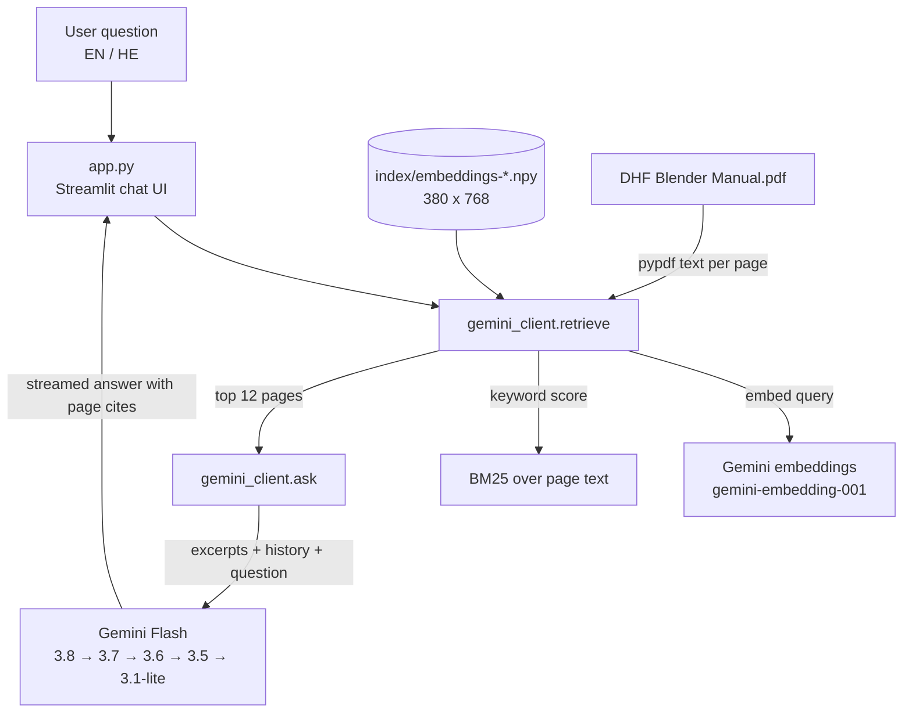

# Architecture

Back to [[Index]]

## Data flow

## Files
| File | Role |
| --- | --- |
| `app.py` | Streamlit UI: sidebar (manual info, models, API key box, New chat), chat history, streaming answers, error messages, RTL styling |
| `gemini_client.py` | Gemini client, page text extraction, embedding index, hybrid retrieval, prompt and model failover |
| `index/embeddings-<hash>.npy` | Prebuilt page embeddings (L2-normalized, 768-dim). Hash = PDF bytes + embed model + dim |
| `DHF Blender Manual.pdf` | Source document (380 pages, ~10 MB, full text layer) |
| `requirements.txt` | `streamlit`, `google-genai`, `python-dotenv`, `pypdf`, `numpy` |
| `run.bat` | One-click local launcher: creates `.venv`, installs deps, creates `.env`, runs Streamlit on localhost |
| `.env.example` | Template for `GEMINI_API_KEY`, `GEMINI_MODEL`, `GEMINI_FALLBACK_MODEL` |
| `.devcontainer/` | Added automatically by Streamlit Community Cloud |
| `Docs/` | This Obsidian vault |

## Key functions (`gemini_client.py`)
- `get_client(api_key)` — `genai.Client` with 120 s timeout and 3 retry attempts.
- `build_index(client)` — extracts text per page (max 8000 chars), loads cached embeddings or embeds all pages (batches of 20, waits 30 s on 429).
- `ManualIndex.bm25(query)` — keyword scores (k1 = 1.5, b = 0.75) with crude plural stemming.
- `retrieve(client, index, query)` — reciprocal-rank fusion of embedding and BM25 rankings, returns top 12 pages in page order.
- `ask(client, models, index, history, question)` — builds the prompt with `[Page N]` excerpts, streams the answer, fails over to the next model on 429 / 503 / timeout.

## Prompt rules (system instruction)
- Answer only from the provided excerpts; say so when the manual does not cover it.
- Cite pages as `(p. N)` using the `[Page N]` markers (PDF page numbers, first page = 1).
- Reply in the language of the question.
- Numbered steps for procedures; reproduce related safety warnings faithfully.
- Use conversation history for follow-ups.

See also [[Retrieval Pipeline]], [[Models and Fallback]].
